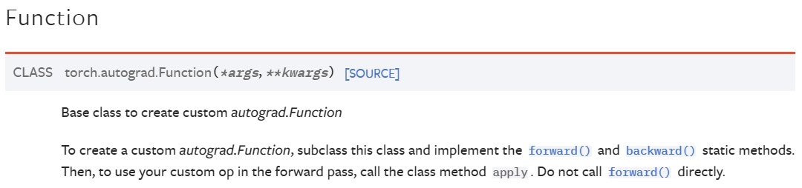

# 使用 `torch.jit.script()` 导出 torchscript 模型

1. 当你在 Python 中使用 `torch.autograd.Function` 自定义操作符时，你不能使用 `torch.jit.script()` 导出模型，因为 torch 目前还不支持。
2. 如果你想要导出自定义操作符的模型，你必须在 C++ 中使用 `torch::autograd::Function<>` 自定义操作符。

<!-- truncate -->

## 未修改代码示例

原有 python 代码：

### 1. `main.py`

```python
from model.calculate import CalculateForce
...

F = CalculateForce.apply(list_neigh, dE, Ri_d, F)
...
```

其中`CalculateForce`是`torch.autograd.Function`的子类，`apply`是`torch.autograd.Function`的静态方法，`list_neigh, dE, Ri_d, F`是`torch.Tensor`类型的参数。

为什么这样用？以及为什么使用`apply`方法调用？

因为`torch.autograd.Function`是一个抽象类，它的子类必须实现`forward`和`backward`方法，而`apply`方法就是调用`forward`方法的。
参考[torch.autograd.Function](https://pytorch.org/docs/stable/autograd.html#torch.autograd.Function)。


### 2. `model/calculate.py`

```python
import torch
from torch.autograd import Function
import op

class CalculateForce(Function):
    @staticmethod
    def forward(ctx, list_neigh, dE, Ri_d, F):
        dims = list_neigh.shape
        batch_size = dims[0]
        natoms = dims[1]
        neigh_num = dims[2] * dims[3]
        ctx.save_for_backward(list_neigh, dE, Ri_d)
        op.calculate_force(list_neigh, dE, Ri_d, batch_size, natoms, neigh_num, F)
        return F

    @staticmethod
    def backward(ctx, grad_output):
        inputs = ctx.saved_tensors
        list_neigh = inputs[0]
        dE = inputs[1]
        Ri_d = inputs[2]
        dims = list_neigh.shape
        batch_size = dims[0]
        natoms = dims[1]
        neigh_num = dims[2] * dims[3]
        grad = torch.zeros_like(dE)
        op.calculate_force_grad(list_neigh, Ri_d, grad_output, batch_size, natoms, neigh_num, grad)
        return (None, grad, None, None)
```

其中`op`是一个自定义的 C++编写的 python 扩展模块，`calculate_force`和`calculate_force_grad`是`op`模块中的两个函数，它们的参数都是`torch.Tensor`类型的。

因为`op`模块编写成了 python 扩展模块，所以它的函数可以直接在 python 中调用，但是这样的话，就不能使用`torch.jit.script()`导出模型了。

## 修改后代码示例

### 1. 代码结构

```bash
ops
├── CMakeLists.txt
├── include
│   └── CalcOps.h
├── src
│   ├── CalcOps.cpp
│   └── CalcOps_bind.cpp
└── test
    └── main.py
```

### 2. `include/CalcOps.h`

这部分代码是自定义操作符的声明，包括`forward`和`backward`方法的声明，以及`torch::autograd::Function<>`的声明。

```cpp
#include <torch/torch.h>
#include <iostream>

class CalculateForceFuncs {
    public:
        static torch::autograd::variable_list forward(
            at::Tensor list_neigh,
            at::Tensor dE,
            at::Tensor Ri_d,
            at::Tensor F);

        static torch::autograd::variable_list backward(
            torch::autograd::variable_list grad_output,
            at::Tensor list_neigh,
            at::Tensor dE,
            at::Tensor Ri_d);
};

class CalculateForce : public torch::autograd::Function<CalculateForce> {
    public:
        static torch::autograd::variable_list forward(
            torch::autograd::AutogradContext *ctx,
            at::Tensor list_neigh,
            at::Tensor dE,
            at::Tensor Ri_d,
            at::Tensor F);

        static torch::autograd::variable_list backward(
            torch::autograd::AutogradContext *ctx,
            torch::autograd::variable_list grad_output);
};

torch::autograd::variable_list calculateForce(
    at::Tensor list_neigh,
    at::Tensor dE,
    at::Tensor Ri_d,
    at::Tensor F);
```

解释：

1. `CalculateForceFuncs`类：这个类定义了两个静态方法，`forward` 和 `backward`。这两个方法分别用于计算前向传播和反向传播。前向传播方法接收四个参数，分别是 `list_neigh`、`dE`、`Ri_d` 和 `F`，并返回一个 `variable_list`。反向传播方法接收四个参数，分别是 `grad_output`、`list_neigh`、`dE` 和 `Ri_d`，并返回一个 `variable_list`。<font color='red'>这个类用于包装 `CalculateForce` 类中的两个静态方法，以便在 `calculateForce` 函数中使用。</font>
2. `CalculateForce`类：这个类继承自 `torch::autograd::Function<CalculateForce>`，这个类是一个模板类，模板参数是 `CalculateForce`，<font color='red'>这个类的作用是将 `CalculateForceFuncs` 类中的两个静态方法包装成一个 `torch::autograd::Function` 类型的对象。</font>这个类定义了两个静态方法，`forward` 和 `backward`。这两个方法分别用于计算前向传播和反向传播。前向传播方法接收五个参数，分别是 `ctx`、`list_neigh`、`dE`、`Ri_d` 和 `F`，并返回一个 `variable_list`。反向传播方法接收两个参数，分别是 `ctx` 和 `grad_output`，并返回一个 `variable_list`。<font color='red'>这个类继承自 `torch::autograd::Function<CalculateForce>`，并且重写了 `forward` 和 `backward` 方法，是为了实现`torch::autograd::Function` 类的纯虚函数 `apply`。</font>
3. `calculateForce`函数：这个函数是一个包装函数，它接收四个参数，分别是 `list_neigh`、`dE`、`Ri_d` 和 `F`，并返回一个 `variable_list`。<font color='red'>这个函数的作用仅仅是调用 `CalculateForce` 类的静态方法 `forward`。</font>
4. 在 PyTorch 中，`torch::autograd::variable_list` 是一个包含 `torch::autograd::Variable` 的 `std::vector`，`torch::autograd::Variable` 是一个包含 `torch::Tensor` 的类。`torch::Tensor` 是一个包含 `torch::Storage` 的类，`torch::Storage` 是一个包含 `void*` 的类，`void*` 是一个指向数据的指针。所以，`torch::autograd::variable_list` 是一个包含指向数据的指针的 `std::vector`。它添加了自动微分的功能，通常用于存储网络的输入和输出，以及反向传播过程中的梯度。
   > 在这里，“包含”是指一个类中有另一个类的实例作为其成员变量。例如，如果我们说类 A 包含类 B，那么意味着类 A 的实例中有一个或多个类 B 的实例作为其成员变量。
   > 例如，`torch::autograd::Variable` 是一个包含 `torch::Tensor` 的类，意味着 `torch::autograd::Variable` 类的实例中有一个 `torch::Tensor` 类的实例作为其成员变量。
   >
   > ```cpp
   > torch::Tensor tensor = torch::randn({2, 3});
   > torch::autograd::Variable variable = torch::autograd::Variable(tensor);
   > ```
   >
   > 在这个例子中，`variable` 是 `torch::autograd::Variable` 类的一个实例，它包含了一个 `torch::Tensor` 实例 `tensor`。
   >
   > `torch::autograd::variable_list` 是一个 `std::vector`，其元素是 `torch::autograd::Variable` 类的实例。这意味着 `torch::autograd::variable_list` 是一个列表，可以存储多个 `torch::autograd::Variable`。
   >
   > ```cpp
   > torch::autograd::Variable var1 = torch::autograd::Variable(torch::randn({2, 3}));
   > torch::autograd::Variable var2 = torch::autograd::Variable(torch::randn({2, 3}));
   > torch::autograd::variable_list var_list = {var1, var2};
   > ```
   >
   > 在这个例子中，`var_list` 是一个 `torch::autograd::variable_list`，它包含了两个 `torch::autograd::Variable` 实例 `var1` 和 `var2`。
5. `torch::autograd::AutogradContext` 是一个用于存储前向传播过程中的中间结果，以便在反向传播过程中使用的类。当定义一个自定义的 `torch::autograd::Function` 时，可以使用 `ctx->save_for_backward` 方法来保存需要在反向传播过程中使用的张量，然后在反向传播过程中使用 `ctx->get_saved_variables` 方法来获取这些张量。此外，还可以使用 `ctx->saved_data` 来保存和获取非张量类型的数据。

以下是一个使用 `torch::autograd::AutogradContext` 和 `torch::autograd::variable_list` 的示例：

```cpp
class MyFunction : public torch::autograd::Function<MyFunction> {
public:
    static torch::autograd::variable_list forward(
        torch::autograd::AutogradContext *ctx,
        torch::autograd::Variable input) {
        ctx->save_for_backward({input});
        return {input * input};
    }

    static torch::autograd::variable_list backward(
        torch::autograd::AutogradContext *ctx,
        torch::autograd::variable_list grad_output) {
        auto saved = ctx->get_saved_variables();
        auto input = saved[0];
        return {2 * input * grad_output[0]};
    }
};

```

在这个例子中，`Myfunction`是一个自定义的 `torch::autograd::Function`，它的 `forward` 方法计算输入的平方，然后保存输入以便在反向传播过程中使用。它的 `backward` 方法计算输入的导数（即` 2 * input`），然后乘以 `grad_output` 来计算输入的梯度。

### 3. `src/CalcOps.cpp`

这部分代码是自定义操作符的实现，包括`forward`和`backward`方法以及`torch::autograd::Function<>`的实现。

```cpp
#include <torch/torch.h>
#include <iostream>
#include "../include/CalcOps.h"
#include "../op_declare.h"

torch::autograd::variable_list CalculateForceFuncs::forward(
    at::Tensor list_neigh,
    at::Tensor dE,
    at::Tensor Ri_d,
    at::Tensor F)
    {
        auto dims = list_neigh.sizes();
        int batch_size = dims[0];
        int natoms = dims[1];
        int neigh_num = dims[2] * dims[3];
        torch_launch_calculate_force(list_neigh, dE, Ri_d, batch_size, natoms, neigh_num, F);
        return {F};

    }

torch::autograd::variable_list CalculateForceFuncs::backward(
    torch::autograd::variable_list grad_output,
    at::Tensor list_neigh,
    at::Tensor dE,
    at::Tensor Ri_d)
    {
        auto dims = list_neigh.sizes();
        int batch_size = dims[0];
        int natoms = dims[1];
        int neigh_num = dims[2] * dims[3];
        auto grad = torch::zeros_like(dE);
        torch_launch_calculate_force_grad(list_neigh, Ri_d, grad_output[0], batch_size, natoms, neigh_num, grad);
        return {torch::autograd::Variable(), grad, torch::autograd::Variable(), torch::autograd::Variable()};
    }

torch::autograd::variable_list CalculateForce::forward(
    torch::autograd::AutogradContext *ctx,
    at::Tensor list_neigh,
    at::Tensor dE,
    at::Tensor Ri_d,
    at::Tensor F)
    {
        ctx->save_for_backward({list_neigh, dE, Ri_d});
        return CalculateForceFuncs::forward(list_neigh, dE, Ri_d, F);
    }

torch::autograd::variable_list CalculateForce::backward(
    torch::autograd::AutogradContext *ctx,
    torch::autograd::variable_list grad_output)
    {
        auto saved = ctx->get_saved_variables();
        auto list_neigh = saved[0];
        auto dE = saved[1];
        auto Ri_d = saved[2];
        return CalculateForceFuncs::backward(grad_output, list_neigh, dE, Ri_d);
    }

torch::autograd::variable_list calculateForce(
    at::Tensor list_neigh,
    at::Tensor dE,
    at::Tensor Ri_d,
    at::Tensor F)
    {
        return CalculateForce::apply(list_neigh, dE, Ri_d, F);
    }
```

其中，`torch_launch_calculate_force`和`torch_launch_calculate_force_grad`是声明在`op_declare.h`中的两个函数。

在 PyTorch 的 C++ API 中，`torch::autograd::Variable()` 创建一个新的、空的张量，这在 C++ 中是用来表示没有梯度或者没有输入的情况的。这与 Python 中的 `None` 在这种上下文中的用法是相同的。

所以，`return {torch::autograd::Variable(), grad, torch::autograd::Variable(), torch::autograd::Variable()};` 在 C++ 中的意义等同于 `return (None, grad, None, None)` 在 Python 中的意义：它返回一个元组，其中 `grad` 是一个张量，表示梯度，而其他三个元素都是 `None` 或 `torch::autograd::Variable()`，表示没有梯度或者没有输入。

### 4. `src/CalcOps_bind.cpp`

这部分代码是自定义操作符的绑定，用于将自定义操作符绑定到 python 中。

```cpp
#include <torch/torch.h>
#include <torch/extension.h>

#include "../include/CalcOps.h"

TORCH_LIBRARY(CalcOps, m) {
    m.def("calculateForce", calculateForce);

}
```

这样做是为了在 python 中可以通过`torch.ops.CalcOps.calculateForce`来调用`calculateForce`函数。

### 5. `CMakeLists.txt`

```cpp
# 1. Basic info
cmake_minimum_required(VERSION 3.2 FATAL_ERROR)
project(CalcOps)
set(CMAKE_CXX_STANDARD 17)
set(CMAKE_CXX_STANDARD_REQUIRED on)
enable_language(CUDA)
set(CMAKE_CUDA_FLAGS "-arch=sm_60")

# 2. include
execute_process(COMMAND python3 -c "import torch; print(torch.utils.cmake_prefix_path)" OUTPUT_VARIABLE TORCH_CMAKE_PREFIX_PATH) ### cmake
string(REPLACE "\n" "" TORCH_CMAKE_PREFIX_PATH ${TORCH_CMAKE_PREFIX_PATH})
list(APPEND CMAKE_PREFIX_PATH ${TORCH_CMAKE_PREFIX_PATH})
# list(APPEND CMAKE_PREFIX_PATH "/data/home/hfhuang/software/anaconda3/envs/pytorch2/lib/python3.11/site-packages/torch/share/cmake/")
find_package(Torch CONFIG REQUIRED)
list(APPEND CMAKE_CXX_FLAGS ${TORCH_CXX_FLAGS})


# 3. set
set(CMAKE_RUNTIME_OUTPUT_DIRECTORY ${CMAKE_BINARY_DIR}/bin)
file(MAKE_DIRECTORY ${CMAKE_RUNTIME_OUTPUT_DIRECTORY})

set(CMAKE_LIBRARY_OUTPUT_DIRECTORY ${CMAKE_BINARY_DIR}/lib)
file(MAKE_DIRECTORY ${CMAKE_LIBRARY_OUTPUT_DIRECTORY})

set(CMAKE_ARCHIVE_OUTPUT_DIRECTORY ${CMAKE_BINARY_DIR}/obj)
file(MAKE_DIRECTORY ${CMAKE_ARCHIVE_OUTPUT_DIRECTORY})


# 4. add


# 5. compile  library
# include_directories("/data/home/hfhuang/software/anaconda3/envs/pytorch2/include/python3.11/")
# include_directories("/data/home/hfhuang/software/anaconda3/envs/pytorch2/lib/python3.11/site-packages/torch/include/")
# include_directories("/data/home/hfhuang/software/anaconda3/envs/pytorch2/lib/python3.11/site-packages/torch/include/torch/csrc/api/include/")
execute_process(COMMAND python3 -c "import sysconfig; print(sysconfig.get_paths()['include'])" OUTPUT_VARIABLE PYTHON_INCLUDE_DIR) ### python
string(REPLACE "\n" "" PYTHON_INCLUDE_DIR ${PYTHON_INCLUDE_DIR}) ### python
execute_process(COMMAND python3 -c "import torch; print(torch.__path__[0])" OUTPUT_VARIABLE TORCH_PATH) ### torch
string(REPLACE "\n" "" TORCH_PATH ${TORCH_PATH}) ### torch
include_directories(${PYTHON_INCLUDE_DIR})
include_directories(${TORCH_PATH}/include/)
include_directories(${TORCH_PATH}/include/torch/csrc/api/include/)
add_library(CalcOps SHARED ${CMAKE_CURRENT_SOURCE_DIR}/src/CalcOps.cpp)
target_include_directories(CalcOps PRIVATE ${CMAKE_CURRENT_SOURCE_DIR})
target_link_libraries(CalcOps PRIVATE ${TORCH_LIBRARIES})

# register_op
add_library(calculate_force_cpp SHARED ${CMAKE_CURRENT_SOURCE_DIR}/calculate_force.cpp) # torch_launch_calculate_force
add_library(calculate_force_grad_cpp SHARED ${CMAKE_CURRENT_SOURCE_DIR}/calculate_force_grad.cpp) # torch_launch_calculate_force_grad

add_library(calculateForce_cu SHARED ${CMAKE_CURRENT_SOURCE_DIR}/kernel/calculateForce.cu) # launch_calculate_force_grad
add_library(calculateForceGrad_cu SHARED ${CMAKE_CURRENT_SOURCE_DIR}/kernel/calculateForceGrad.cu) # launch_calculate_force_grad

# CalcOps 链接 calculate_force_cpp 和 calculate_force_grad_cpp中的函数： CalcOps 调用torch_launch_calculate_force 和 torch_launch_calculate_force_grad
target_link_libraries(CalcOps PRIVATE calculate_force_cpp ${TORCH_LIBRARIES})
target_link_libraries(CalcOps PRIVATE calculate_force_grad_cpp ${TORCH_LIBRARIES})

# calculate_force_cpp 和 calculate_force_grad_cpp 链接 calculateForce_cu 和 calculateForceGrad_cu 中的函数： calculate_force_cpp 和 calculate_force_grad_cpp 调用 launch_calculate_force 和 launch_calculate_force_grad
target_link_libraries(calculate_force_cpp PRIVATE calculateForce_cu ${TORCH_LIBRARIES})
target_link_libraries(calculate_force_grad_cpp PRIVATE calculateForceGrad_cu ${TORCH_LIBRARIES})

add_library(CalcOps_bind SHARED ${CMAKE_CURRENT_SOURCE_DIR}/src/CalcOps_bind.cpp)
target_compile_features(CalcOps_bind PRIVATE cxx_std_17)
# target_include_directories(CalcOps_bind PRIVATE "/data/home/hfhuang/software/anaconda3/envs/pytorch2/include/python3.11/")

# CalcOps_bind 链接 CalcOps 和 torch
target_link_libraries(CalcOps_bind PRIVATE CalcOps ${TORCH_LIBRARIES})
```

编译命令：

```bash
mkdir build
cd build
cmake ..
make
```

### 6. `test/main.py`

```python
import torch
torch.ops.load_library("/path/to/build/lib/libCalcOps_bind.so")
...

F = torch.ops.CalcOps.calculateForce(list_neigh, dE, Ri_d, F)
...
```

:::tip

1. 在 python 中使用`torch.ops.load_library`加载自定义操作符的动态链接库。
2. 在 python 中使用`torch.ops.CalcOps.calculateForce`调用自定义操作符。
3. 环境变量`LD_LIBRARY_PATH`中必须包含`libCalcOps_bind.so`所在的路径，以及`libpython3.x.so`所在的路径。例如：
   ```bash
    export LD_LIBRARY_PATH=$LD_LIBRARY_PATH:/path/to/build/lib/:/path/to/anaconda3/envs/pytorch2/lib/
    ```
   :::

## 在其他软件的接口中使用调用动态库

编译 Lammps 时，需要在`Makefile.mpi`中添加一些链接库的路径，例如：

```makefile
LINKFLAGS += -L/path/to/build/lib -lCalcOps_bind
# 还需要添加python的链接库路径
PYTHON_LIB_PATH = $(shell python3-config --prefix)/lib
LINKFLAGS += -L$(PYTHON_LIB_PATH) -lpython3.11 -static-libstdc++ -static-libgcc
```

其中，使用静态链接`-static-libstdc++ -static-libgcc`是为了解决链接器不支持的GNU属性类型的问题.

如：

```bash
/opt/rh/devtoolset-8/root/usr/libexec/gcc/x86_64-redhat-linux/8/ld: warning: /data/home/hfhuang/software/anaconda3/envs/pytorch2/lib/libstdc++.so: unsupported GNU_PROPERTY_TYPE (5) type: 0xc0010001
...
```
