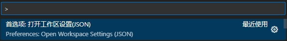

1. 打开 vscode 设置：`ctrl + Shift + p` 输入 `settings` 选择 `Open Workspace Settings (JSON)`(打开工作区设置)
   * 

2. 添加如下配置：
   ```json
   "workbench.colorCustomizations": {
	"terminal.background":"#1D1F21",
	"terminal.foreground":"#C5C8C6",
	"terminalCursor.background":"#C5C8C6",
	"terminalCursor.foreground":"#C5C8C6",
	"terminal.ansiBlack":"#1D1F21",
	"terminal.ansiBlue":"#3971ED",
	"terminal.ansiBrightBlack":"#969896",
	"terminal.ansiBrightBlue":"#3971ED",
	"terminal.ansiBrightCyan":"#3971ED",
	"terminal.ansiBrightGreen":"#198844",
	"terminal.ansiBrightMagenta":"#A36AC7",
	"terminal.ansiBrightRed":"#CC342B",
	"terminal.ansiBrightWhite":"#FFFFFF",
	"terminal.ansiBrightYellow":"#FBA922",
	"terminal.ansiCyan":"#3971ED",
	"terminal.ansiGreen":"#198844",
	"terminal.ansiMagenta":"#A36AC7",
	"terminal.ansiRed":"#CC342B",
	"terminal.ansiWhite":"#C5C8C6",
	"terminal.ansiYellow":"#FBA922"
    },
   ```

3. 其他颜色配置参考：[Base16 Terminal Colors for Visual Studio Code](https://glitchbone.github.io/vscode-base16-term/#/rebecca)
    