## 前言

vasp 6.x版本提供了全新的GPU版本，目前官方给出的效率最高的编译方式是openmp+openmp混合编译的方式，下面将在非**root**权限下介绍这个编译方式。推荐使用[**modules**](https://modules.readthedocs.io/en/latest/)等包管理系统管理不同版本的库。有关其他的编译方法可以查看官方给出的[测试](https://www.vasp.at/wiki/index.php/Toolchains)以及VASP源代码内arch文件夹的相关[makefile.include](https://www.vasp.at/wiki/index.php/Makefile.include)

> *注：CentOS 8系统在2021年12月31日已停止维护服务，CentOS 7系统将于2024年06月30日停止维护服务。目前很多package最新版本已不再支持CentOS，如yum源里的modules，oneapi；虽然可以手动编译，但是不确定最新版本会不会有bug。有条件的可以换新的linux系统，如rocky 等等*

<!-- truncate -->

## gcc 9.4.0

### 1. 获取源代码

首先，在gcc的官方镜像下载安装包：https://ftp.gnu.org/gnu/gcc/

这里选的是9.4.0版本，更高的版本也可以选择

> *CentOS 7自带的gcc是4.8.5，在编译cuda等其他库时，有时候会出现bug。此外，对于使用gcc编译cpu版本vasp，最好使用大于8.0的版本，切勿使用gcc 8.x版本，会导致编译出错*

可以简单使用wget进行下载，解压，进入文件夹：

```bash
wget https://ftp.gnu.org/gnu/gcc/gcc-9.4.0/gcc-9.4.0.tar.gz
tar -zxvf gcc-9.4.0.tar.gz
cd gcc-9.4.0
```

### 2. 编译gcc

联网情况下可以自动下载依赖包

```bash 
./contrib/download_prerequisites
```

若是处于内网无法连接网站，可以使用**vi**查看该文件

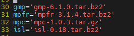

在官方[网站](https://gcc.gnu.org/pub/gcc/infrastructure/)下载对应版本依赖包，并放在主目录下重新执行上述命令。注意，该命令执行完成后没有文本输出。

最后，新建一个文件夹用于编译：

```bash
mkdir build-gcc
cd build-gcc
../configure --enable-languages=all --prefix=/path to install/
make -j && make install
```

> ***prefix 用于存放编译后的文件存放的路径，该路径用于后续的环境配置，更多详细的configure内容可以查看官方文档https://gcc.gnu.org/install/configure.html***

### 3. 环境配置

如果系统上安装好了modules，首先创建自己的modulefile目录

```bash
mkdir /path to modulefiles/
echo "export MODULEPATH=/path to modulefiles:$MODULEPATH" >> ~/.bashrc
bash or source ~/.bashrc
```

在该目录下创建属于gcc的modulefile，可以参照下面的进行编写：

```bash
cd /path to modulefiles/
vi gcc-9.4.0

#%Module1.0
module-whatis "gcc.9.4.0"

set app_dir /path to install/

prepend-path PATH 				${app_dir}/bin
prepend-path LIBRARY_PATH 		${app_dir}/lib
prepend-path LD_LIBRARY_PATH 	${app_dir}/lib
prepend-path LIBRARY_PATH		${app_dir}/lib64
prepend-path LD_LIBRARY_PATH 	${app_dir}/lib64
prepend-path CPATH 				${app_dir}/include
prepend-path CMAKE_PREFIX_PATH  ${app_dir}

setenv CC 	${app_dir}/bin/gcc
setenv CXX  ${app_dir}/bin/g++
setenv FC 	${app_dir}/bin/gfortran
setenv F77 	${app_dir}/bin/gfortran
setenv F90 	${app_dir}/bin/gfortran
```

```bash
set          #设置modulefile 内部的变量
set env      #设置系统环境变量
prepand-path #效果类似于 export PATH=/path:$PATH
```

此时，module avail 里就会出现对应的gcc-9.4.0，使用module load即可加载。

如果不使用module的形式，则需要手动export对应的路径：

```bash
export PATH=/path to install/bin:$PATH
export LD_LIBRARY_PATH=/path to install/lib:/path to install/lib64:$LD_LIBRARY_PATH
```

注意，export只在当前窗口生效，退出重进后就无效了。

> *不建议将环境变量直接添加进**bashrc**或**bash_profile**，可以将编译软件所需的环境统一写进文件内，使用软件前调用对应环境*
>
> ```bash
> vi envs       #添加所需export的环境
> source envs   #使用软件前
> ```

## cuda 11.0

### 1. 获取安装包

首先，查看自己系统的gpu驱动版本，注意：位于登陆节点时，需ssh进gpu计算节点才可以查看

```bash
 nvidia-smi
```

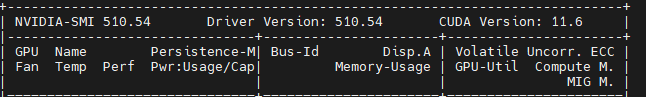

**这里显示的CUDA Version只是代表该驱动支持的最高版本的CUDA，不是系统安装的cuda版本！！！**

如需使用更高的cuda版本，需更新驱动版本；官方提供了[查询驱动版本和对应支持的cuda版本](https://docs.nvidia.com/cuda/cuda-toolkit-release-notes/index.html#cuda-major-component-versions__table-cuda-toolkit-driver-versions)

在官方驱动[下载页面](https://www.nvidia.com/download/find.aspx)检索对应的驱动下载，使用以下命令查看系统的cuda版本：

```bash
nvcc --version
```

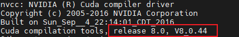

在这里，可以看到，这个系统安装的是cuda 8.0，不符合nvhpc需要版本；选择cuda 11.0进行下载安装；

下载前，查询系统版本

```bash
cat /proc/version #或者使用lsb_release -a
```

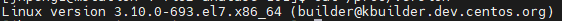

可以看到，这里显示的是7版本的centos，x86_64框架；进去[cuda下载网页](https://developer.nvidia.com/cuda-toolkit-archive)选择对应版本的cuda：

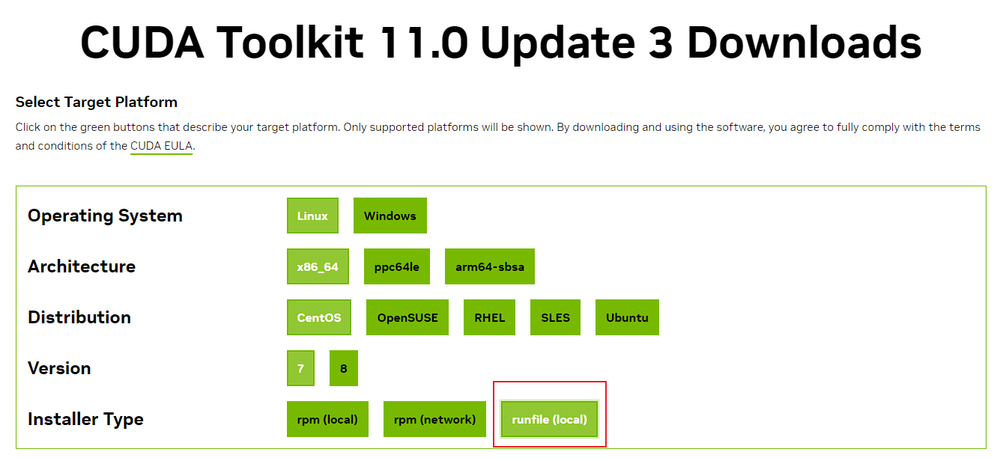

选择runfile(local)进行下载安装

```bash
wget https://developer.download.nvidia.com/compute/cuda/11.0.3/local_installers/cuda_11.0.3_450.51.06_linux.run
```

> 下载过程可能会十分漫长

### 2. 安装cuda

首先加载gcc-9.4.0，然后给安装包赋予执行权限并执行

```bash
module load gcc-9.4.0 #export 
chmod +x cuda_11.0.3_450.51.06_linux.run
./cuda_11.0.3_450.51.06_linux.run
```

之后的安装过程是可视化安装，使用方向键来进行选择，下面给出一些关键的修改部分

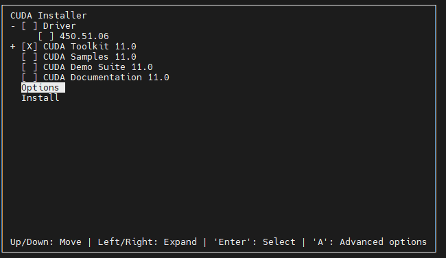

只需要安装CUDA Toolkit，进入options更改安装路径

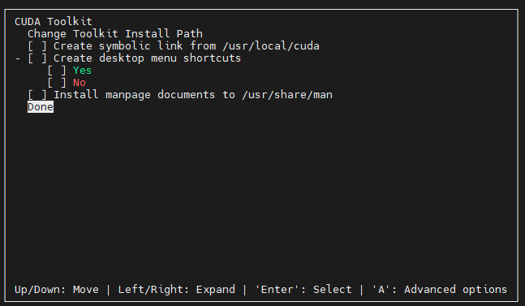

选择Toolkit，在Change Toolkit Install Path修改路径为自己想要的路径/path to cuda/, 反选其他选项

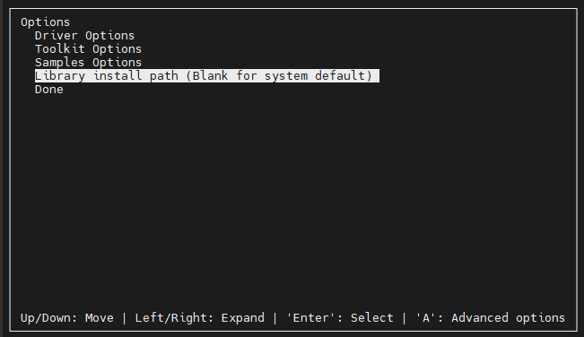

选择Library install path，修改路径与Toolkit一致，之后选择install，等待安装完成

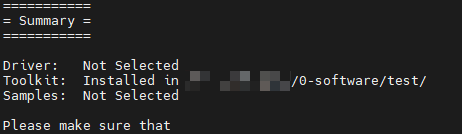

显示上述信息则为安装完成

### 3. 环境配置

配置modulefiles，参考如下

```bash
cd /path to modulefiles/
vi cuda-11.0

#%Module
module-whatis   "CUDA-11.0"

set app_dir    /path to cuda/

prepend-path    PATH            		$app_dir/bin
prepend-path    LD_LIBRARY_PATH 		$app_dir/lib64
prepend-path    LD_RUN_PATH     		$app_dir/lib64
prepend-path    LIBRARY_PATH    		$app_dir/lib64
prepend-path    CPATH          			$app_dir/include
prepend-path    CUDADIR        			$app_dir
prepend-path    CUDA_TOOLKIT_ROOT_DIR   $app_dir
```

或直接手动export

```bash
export PATH=/path to cuda/bin:$PATH
export LD_LIBRARY_PATH=/path to install/lib64:$LD_LIBRARY_PATH
```

## nvhpc 23.9

### 1. 获取安装包

nvhpc作为一个新推出的编译库，整个安装就相对来说比较方便，在[官网](https://developer.nvidia.com/hpc-sdk-downloads)下载对应系统版本的nvhpc：

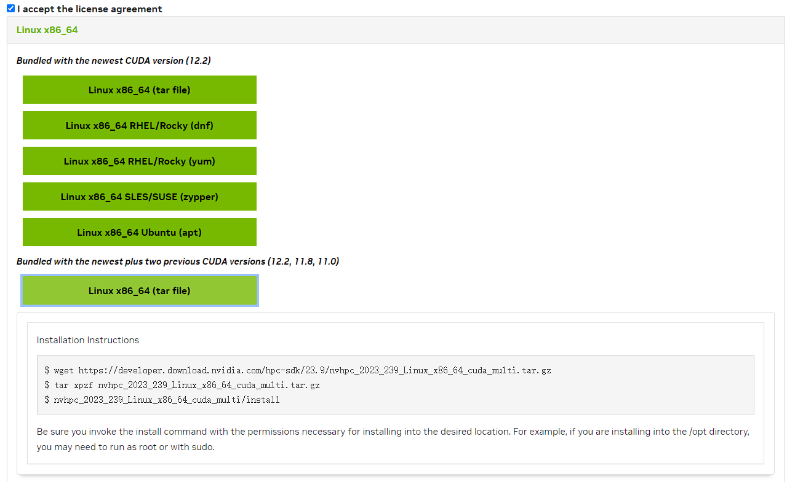

选择bundled版本，支持更多的cuda版本，注意是否有包含自己所安装的cuda版本

```bash
wget https://developer.download.nvidia.com/hpc-sdk/23.9/nvhpc_2023_239_Linux_x86_64_cuda_multi.tar.gz
tar xpzf nvhpc_2023_239_Linux_x86_64_cuda_multi.tar.gz
```

### 2. 安装nvhpc

首先加载按照的gcc以及cuda，然后运行install

```bash
module load gcc-9.4.0 cuda-11.0
nvhpc_2023_239_Linux_x86_64_cuda_multi/install
```

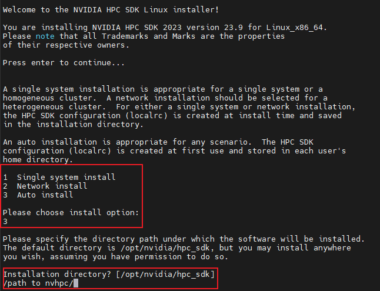

选择3 auto installl，然后填写安装路径/path to nvhpc/，等待安装完成

### 3. 环境配置

nvhpc提供编写好的modulefile，只需要将文件夹下的拷贝到自己存放的路径

```bash
cp -rf /path to nvhpc/modulefiles /path to modulefiles/
module load nvhpc/nompi
```

> ***这里建议使用nvhpc-nompi搭配openmpi编译VASP***

此外，安装好也会提供所需export的路径：

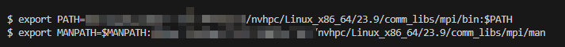

## openmpi 4.1.5

### 1. 获取安装包

在[官网](https://www.open-mpi.org/software/ompi/v5.0/)选择合适的版本，推荐使用尽量新的版本以适配cuda及更好的gpu并行性能，这里选择4.1.5版本

```bash
wget https://download.open-mpi.org/release/open-mpi/v4.1/openmpi-4.1.5.tar.gz
tar -zxvf openmpi-4.1.5.tar.gz
cd openmpi-4.1.5
```

在集群拥有ib等高速通讯装置时，建议参考[官方安装教程](https://www.open-mpi.org/faq/?category=buildcuda)编译好相应版本的ucx，gdrcopy等依赖库；这里由于使用的是单机版本，所以本次编译选择不使用ucx

### 2. 安装openmpi with cuda-aware

为了更好的效率以及兼容性，我们使用nvhpc来编译openmpi

```bash
module load gcc-9.4.0 cuda-11.0 nvhpc/nompi
./configure ./configure CC=pgcc FC=pgfortran CXX=pgc++ --prefix=/path to openmpi/ --with-cuda=/path to cuda/include --with-tm=/opt/torque --disable-builtin-atomics --without-slurm --without-ucx --with-hwloc=internal
#CC FC CXX 指定使用的编译器，这里使用nvhpc的编译器
#--prefix 是路径的选择
#--with-cuda 选择对应使用的cuda版本的cuda.h文件所在位置，通常在根目录下的/include
#--with-tm 指定torque/PBS 排队系统的安装根目录，slurm系统默认安装，不要添加额外的路径
#--disable-builtin-atomics --with-hwloc=internal 禁用一些系统底层的自带包，降低bug的出现几率
#--without-slurm --without-ucx 不编译slurm及ucx，如需要ucx，请使用--with-ucx=/PATH/
make -j && make install
```

等待一段时间即可安装完成，完成后可以使用以下命令检查是否安装好cuda-aware以及pbs支持

```bash
ompi_info --parsable --all | grep mpi_built_with_cuda_support:value
ompi_info | grep tm
```

> *编译过程中可能出现大量的warnning，实际上不影响正常编译，大部分是不同版本的C或者C++语法的规范性警告。*

### 3. 环境配置

配置modulefiles，参考如下

```bash
cd /path to modulefiles/
vi openmpi-4.1.5

#%Module
module-whatis   "openmpi 4.1.5"
module load gcc-9.4.0
module load cuda-11.0
module load nvhpc-nompi/23.9

set app_dir     /path to openmpi/

prepend-path    PATH            $app_dir/bin
prepend-path    LD_LIBRARY_PATH $app_dir/lib
prepend-path    MANPATH         $app_dir/share/man
prepend-path    PKG_CONFIG_PATH $app_dir/lib/pkgconfig
setenv MPICC    $app_dir/bin/mpicc
setenv MPICXX   $app_dir/bin/mpic++
setenv MPIF77   $app_dir/bin/mpif77
setenv MPIF90   $app_dir/bin/mpif90
setenv OPENMPI_ROOT $app_dir
```

> *可以在modulefiles指定编译预先使用的前置包，这样只需要加载openmpi就可以加载对应的前置包*

或直接手动export

```bash
export PATH=/path to openmpi/bin:$PATH
export LD_LIBRARY_PATH=/path to openmpi/lib:$LD_LIBRARY_PATH
export MANPATH=/path to openmpi/share/man:$MANPATH
```

## vasp 6.4.x

除了上述的编译库以外，vasp还需要对应的数学运行库，比如FFT，BLAS，LAPACK，ScaLAPACK

这里直接使用intel-mkl，mkl可以通过免费的oneapi安装，也可以联系对应的集群管理人员获取2020前的parallel_studio_xe。

> *oneapi-2023已经不支持CentOS的Linux，手动安装不确定是否会出现bug；而one-api目前只支持最新版本的下载，旧版本需联系商务支持人员才可以获得；而paralle_studio均为商用版本，需要license授权。*

可以使用下述命令查看mkl所在目录：

```bash
echo $MKLROOT
```

**VASP也是商业授权软件，源代码请联系购买了版权的单位或者个人。**

下面开始编译vasp-openacc版本：

```bash
module load openmpi-4.1.5
#module load mkl
tar -zxvf vasp.6.4.x.tgz
cd vasp.6.4.x
```

选择使用openacc和openmp混合编译的方式，拷贝对应的makefile

```bash
cp arch/makefile.include.nvhpc_ompi_mkl_omp_acc makefile.include
vi makefile.include
```

修改对应的目录及使用的编译库

```bash
 80 # Intel MKL for FFTW, BLAS, LAPACK, and scaLAPACK
 81 MKLROOT    ?= /path to mkl/ #修改为系统下mkl的路径
 
 85 # Use a separate scaLAPACK installation (optional but recommended in combination with OpenMPI)
 86 # Comment out the two lines below if you want to use scaLAPACK from MKL instead
 87 # SCALAPACK_ROOT ?= /path/to/your/scalapack/installation  使用mkl，注释掉这行
 88 # LLIBS_MKL   = -L$(SCALAPACK_ROOT)/lib -lscalapack -Mmkl 使用mkl，注释掉这行
 
 #HDF5-support  #VASP-2-Wannier90 interface 按照需要自行修改路径
```

在使用如v100，H100等具有更高的双精度算力的专业卡时，可以添加以下的命令进一步加速

```bash
## Improves performance when using NV HPC-SDK >=21.11 and CUDA >11.2
OFLAG_IN   = -fast -Mwarperf
SOURCE_IN  := nonlr.o
```

此外，vasp官方推荐使用单独的scaLAPACK，也可以使用mkl集成的；编译scaLAPACK需要OpenBLAS，可以查看鲲鹏HPC提供的安装指南：

> [安装OpenBLAS](https://www.hikunpeng.com/document/detail/zh/kunpenghpcs/prtg-osc/openmind_kunpengqe_02_0006.html) 
>
> [安装ScaLAPACK](https://www.hikunpeng.com/document/detail/zh/kunpenghpcs/prtg-osc/openmind_kunpengqe_02_0007.html)

修改好makefile.include后，即可开始编译vasp，大概需要0.5~1小时左右

```bash
make all DEPS=1 -j 16
```

编译完成后，在根目录bin下会出现vasp_std，vasp_gam，vasp_ncl的可执行文件，和5.x版本的gpu不同，此时的bin文件不再带有gpu的标识，请自行修改文件名字进行辨识。除了涉及到RPA的计算以外，大部分的计算均可以使用openacc-GPU版本进行计算。

最后，提交计算时，需要添加openmp的相关参数，以获得更好的性能；可以参考[官方教程](https://www.vasp.at/wiki/index.php/Combining_MPI_and_OpenMP)，这里也提供一个本人经测试过可以使用的提交文件：

```bash
#!/bin/bash
#PBS -N vasp
#PBS -l nodes=1:ppn=4
#PBS -q batch
#PBS -l walltime=99999:00:00 
#above setting depend on your own system

module load openmpi-4.1.5 
cd $PBS_O_WORKDIR
NP=`cat $PBS_NODEFILE | wc -l`
ulimit -s unlimited

#vasp_std vasp_gam vasp_ncl
vasp=/path to vasp/

nthrds=4 #thread per GPU, total for cpus-per-task, do not exceed the total number of physical cores
mpi="-np $NP --map-by node:PE=$nthrds --bind-to core -x OMP_NUM_THREADS=$nthrds "
# For the GNU or NVIDIA OpenMP runtime (gomp/nvomp)
omp="-x OMP_STACKSIZE=512m -x OMP_PLACES=cores -x OMP_PROC_BIND=close"

VASP="mpirun $mpi $omp $vasp"
$VASP >log
```

